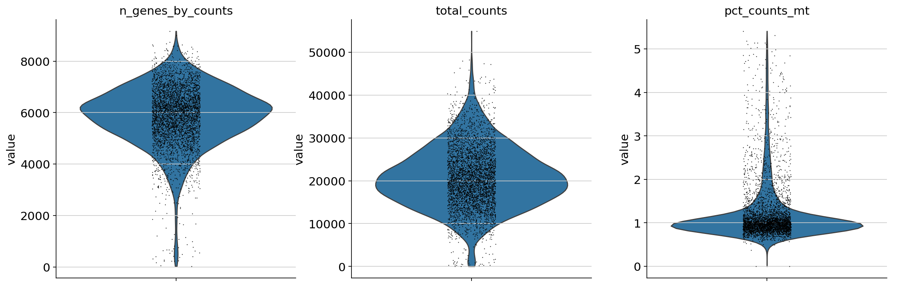
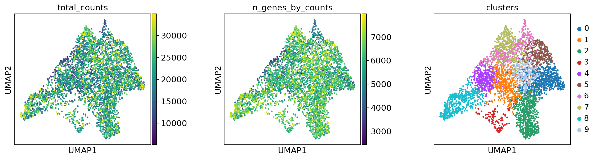
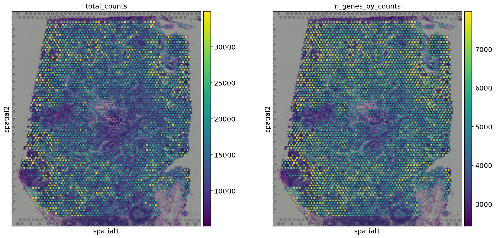
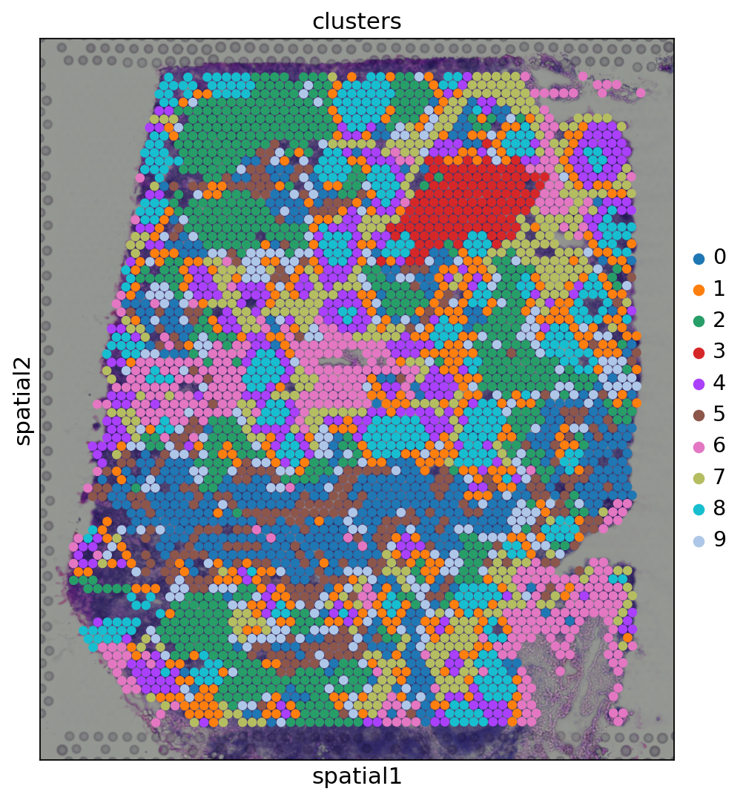
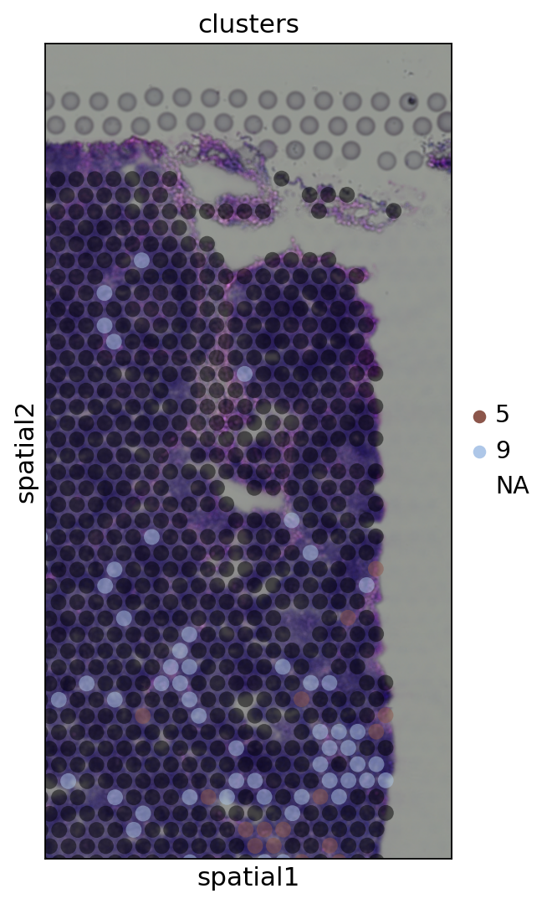
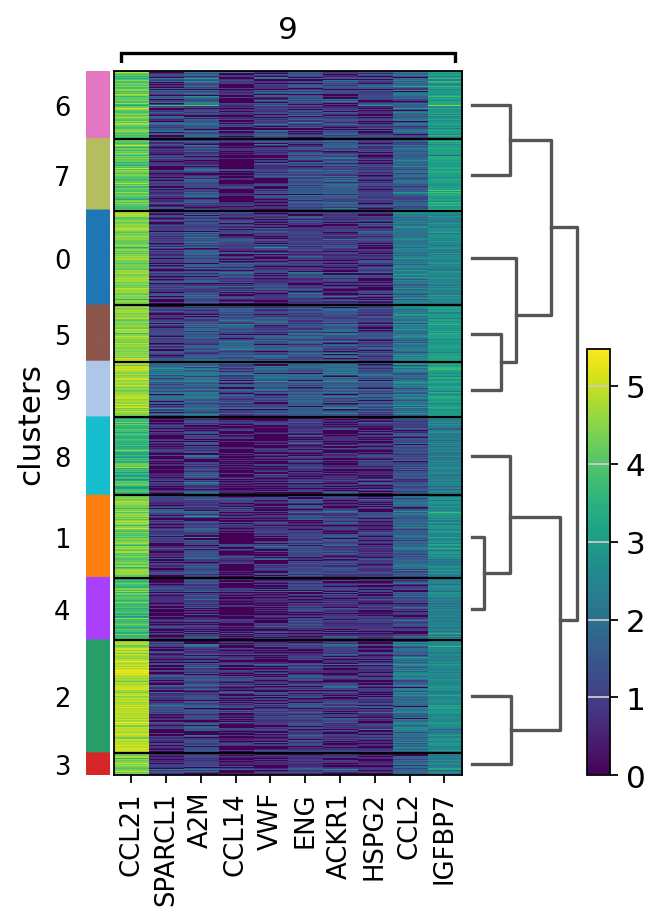
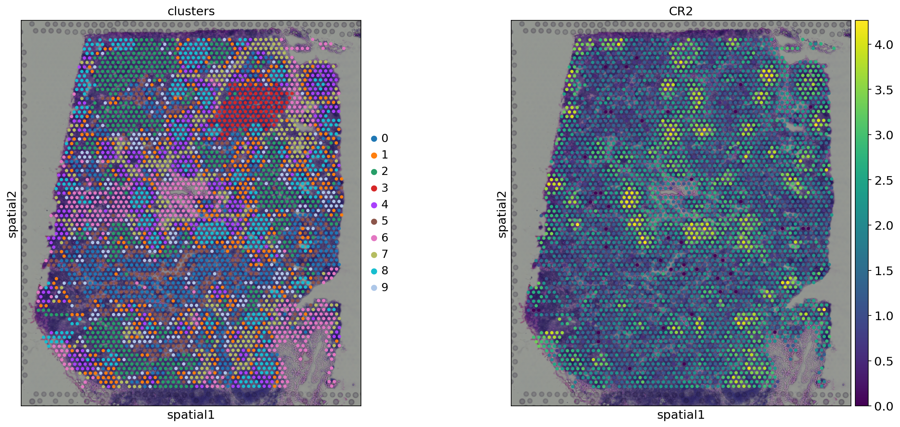

# Notebook 1 — Basic Spatial Analysis with Scanpy

**Author:** Saleha Asim  
**Original Tutorial:** [Scanpy Spatial Basic Analysis](https://scanpy-tutorials.readthedocs.io/en/latest/spatial/basic-analysis.html)  
**Dataset:** Human Lymph Node — 10x Genomics Visium  

---

## Overview

This notebook demonstrates a foundational spatial transcriptomics pipeline using Scanpy on a 10x Genomics Visium dataset of a human lymph node. The workflow follows the standard single-cell analysis pipeline — quality control, normalization, clustering — but with the added dimension of mapping every result back onto the physical tissue image. This allows gene expression patterns to be interpreted in the context of real tissue anatomy.

The dataset is loaded directly via `sc.datasets.visium_sge()` and returns an `AnnData` object containing the gene expression count matrix, high-resolution tissue image, and spatial barcoded coordinates for each spot.

---

## Pipeline

### 1. Data Loading & AnnData Structure

The data is loaded as an `AnnData` object — the central data structure used by Scanpy. Understanding its layout is important for interpreting everything that follows:

- **`adata.X`** — the count matrix (spots × genes)
- **`adata.obs`** — spot-level metadata (e.g. QC metrics, cluster labels)
- **`adata.var`** — gene-level metadata (e.g. whether a gene is mitochondrial)
- **`adata.obsm['spatial']`** — the (x, y) coordinates of each spot on the tissue
- **`adata.uns['spatial']`** — the tissue image and scale factors

Mitochondrial genes are flagged with `adata.var["mt"]` by identifying genes whose names start with `MT-`. These are used as a quality indicator in the next step.

---

### 2. Quality Control

#### Violin Plots



Each violin shows the distribution of a QC metric across all spots. The three metrics plotted are:

- **`n_genes_by_counts`** — number of unique genes detected per spot
- **`total_counts`** — total RNA molecules captured per spot
- **`pct_counts_mt`** — percentage of counts coming from mitochondrial genes

The width of the violin at any given value indicates how many spots have that value. A narrow, tall violin with a low-spread body is ideal. Spots with very low gene counts are likely empty or damaged. Spots with very high mitochondrial percentages suggest cell stress or lysis. These plots give an intuitive overview of data quality before any filtering is applied.

#### Count & Gene Histograms


Four histograms are plotted in a 2×2 arrangement:

- **Panel 1:** Full distribution of total RNA counts per spot
- **Panel 2:** Zoomed view of spots with fewer than 10,000 counts — reveals the low-count tail where problematic spots cluster
- **Panel 3:** Full distribution of genes detected per spot
- **Panel 4:** Zoomed view of spots with fewer than 4,000 genes detected

The zoomed panels are necessary because a small number of high-count outlier spots can compress the x-axis, hiding the structure at the low end where filtering decisions need to be made. Together, these histograms inform the thresholds applied in the next step.

#### Filtering Thresholds Applied

```
Minimum total counts:  5,000
Maximum total counts:  35,000
Maximum MT%:           20%
Minimum cells per gene: 10
```

Spots below 5,000 counts are likely empty tissue. Spots above 35,000 may be doublets (two cells captured in one spot). Spots with >20% mitochondrial reads suggest dying or damaged cells whose cytoplasmic RNA has leaked out, leaving mitochondrial RNA disproportionately behind.

---

### 3. Normalization & Feature Selection

**Normalization** (`normalize_total`) scales each spot so that its total count sums to 10,000, correcting for differences in sequencing depth across spots. **Log transformation** (`log1p`) then compresses the dynamic range of the data, making the distribution more Gaussian and suitable for PCA.

**Highly variable gene selection** (`highly_variable_genes`, Seurat method, top 2,000 genes) retains only the genes that vary most across spots. Using all ~36,000 genes would be computationally wasteful and would dilute the signal with uninformative, constitutively expressed genes.

---

### 4. Dimensionality Reduction & Clustering

PCA reduces the 2,000-gene feature space to a compact set of principal components. A neighborhood graph is then built in PCA space, connecting spots with similar transcriptional profiles. UMAP projects this graph into 2D for visualization. Leiden clustering detects communities in the neighborhood graph — groups of spots that are more densely connected to each other than to the rest, without requiring a pre-specified number of clusters.

#### UMAP Plots



Three UMAP panels are shown:

- **Total counts** — checks for technical bias; if sequencing depth drove separation, high-count spots would form their own cluster. Here the counts are distributed evenly across clusters, confirming that our clustering reflects biology, not technical artifact.
- **Genes by counts** — similarly distributed across the UMAP, another indication that QC was effective.
- **Leiden clusters** — the main result: discrete transcriptional communities, each representing a distinct cell population or tissue region.

---

### 5. Spatial Visualization

#### Total Counts & Gene Detection Overlaid on Tissue



Total counts and gene detection rates are projected back onto the tissue image. This reveals whether sequencing depth is uniform across the tissue or whether certain regions are systematically better captured. Uneven spatial patterns here would indicate technical issues with the Visium slide preparation.

#### Leiden Clusters on Tissue



Spots are colored by their Leiden cluster identity and overlaid on the H&E tissue image. The key observation is that **clusters are spatially coherent** — spots belonging to the same transcriptional cluster tend to occupy the same anatomical region of the tissue. This is not enforced by the algorithm; the clustering was computed purely from gene expression. Spatial coherence is therefore biological validation that the clusters are real.

#### Zoomed View — Clusters 5 and 9



Clusters 5 and 9 are isolated and the view is cropped to the upper-right region of the tissue. The `alpha=0.5` transparency setting allows the underlying H&E morphology to show through the colored spots, making it possible to correlate transcriptional identity with visible tissue structure. Cluster 9 spots are concentrated in small, discrete foci that correspond morphologically to germinal centers in the lymph node.

---

### 6. Marker Gene Analysis

`sc.tl.rank_genes_groups` performs a t-test for each cluster against all other clusters, identifying genes that are differentially expressed in each cluster. The top 10 marker genes for cluster 9 are visualized in a heatmap.

#### Heatmap — Top 10 Markers for Cluster 9



The heatmap shows expression levels of the top 10 marker genes for cluster 9 across all clusters. Each column is a gene, each row is a cluster. Deep color in the cluster 9 row with low expression in other rows indicates a gene that is specific to that cluster. The specificity of these markers validates that Leiden clustering has identified biologically distinct populations.

---

### 7. Spatial Gene Expression

#### CR2 Expression



CR2 (Complement Receptor 2, also known as CD21) is a surface marker of mature B cells and follicular dendritic cells. Its spatial expression pattern closely mirrors the location of cluster 9 spots, confirming that cluster 9 corresponds to germinal center B cells. This is anatomically expected: germinal centers are the sites within lymph nodes where B cells undergo affinity maturation and immunoglobulin class switching. The spatial match between a gene expression cluster and a known marker gene is the strongest validation this pipeline can produce.

#### COL1A2 and SYPL1 Expression


Two additional genes are mapped spatially at `alpha=0.7` transparency:

- **COL1A2** (Collagen Type I Alpha 2) — a marker of stromal fibroblasts and connective tissue. It is expected to be expressed in the fibrous capsule and trabeculae surrounding the lymph node, which is what the spatial plot shows.
- **SYPL1** (Synaptophysin-like protein 1) — expressed in a distinct, non-overlapping region, illustrating that different cell types occupy spatially segregated niches even within a single tissue section.

The use of `alpha=0.7` lets the H&E image show through, directly correlating gene expression with tissue morphology visible to the eye.

---

## Key Takeaways

- Spatial transcriptomics data follows the same QC and preprocessing logic as scRNA-seq, but with the added step of mapping results back to tissue coordinates.
- Leiden clusters computed purely from gene expression are spatially coherent, demonstrating that transcriptional identity and anatomical location are tightly coupled in the lymph node.
- Cluster 9 maps to germinal centers, validated by CR2 expression — a canonical B cell marker.
- Different genes mark different spatial niches (COL1A2 for stroma, CR2 for germinal centers), illustrating the power of spatial context for biological interpretation.

---

## Dependencies

```bash
pip install scanpy seaborn igraph leidenalg squidpy
```

## References

- Wolf et al. (2018) SCANPY: large-scale single-cell gene expression data analysis. *Genome Biology*. https://doi.org/10.1186/s13059-017-1382-0
- Traag et al. (2019) From Louvain to Leiden: guaranteeing well-connected communities. *Scientific Reports*. https://doi.org/10.1038/s41598-019-41695-z
- McInnes et al. (2018) UMAP: Uniform Manifold Approximation and Projection. *arXiv*. https://arxiv.org/abs/1802.03426

