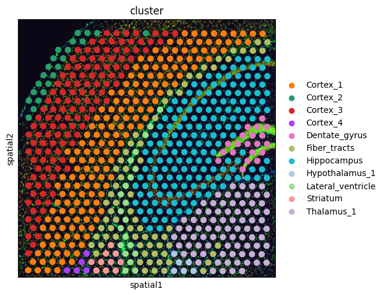
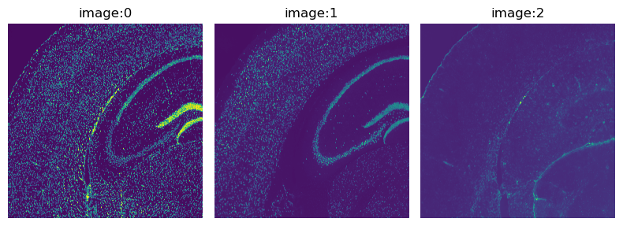
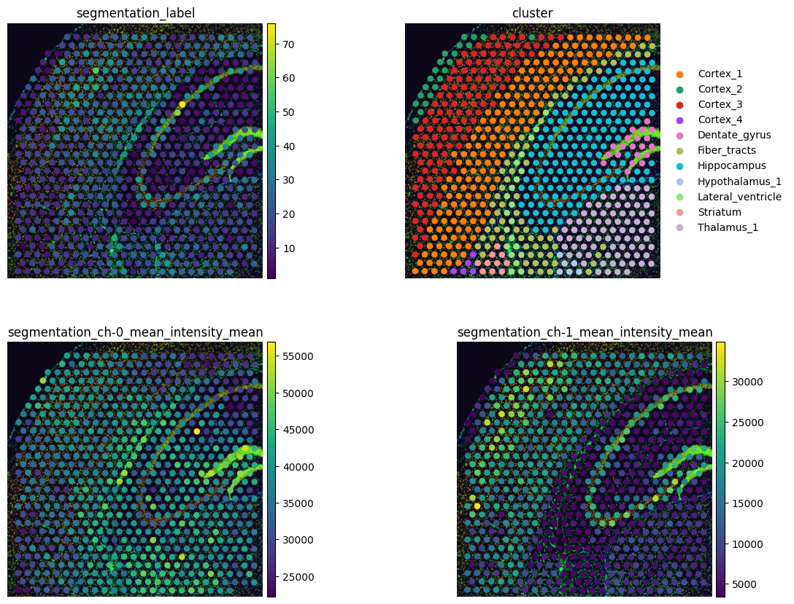
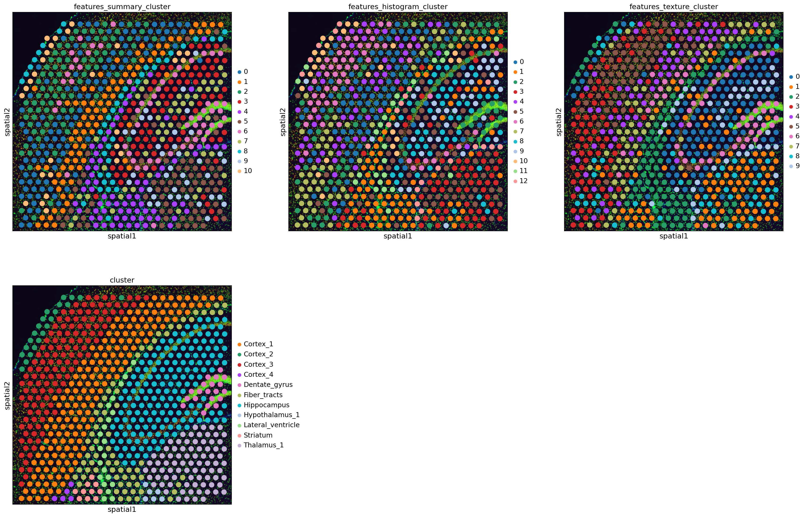
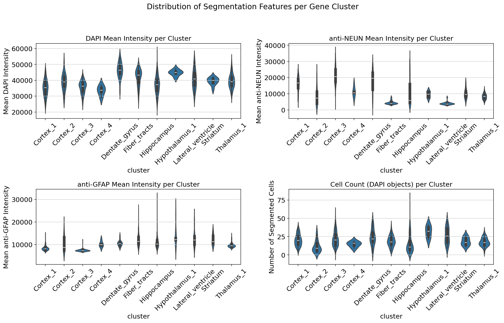

# Notebook 2 — Visium Fluorescence Image Analysis with Squidpy

**Author:** Saleha Asim  
**Original Tutorial:** [Squidpy Visium Fluorescence Tutorial](https://squidpy.readthedocs.io/en/stable/notebooks/tutorials/tutorial_visium_fluo.html)  
**Dataset:** Mouse Brain Coronal Section — 10x Genomics Visium (fluorescence, pre-processed crop)

---

## Overview

This notebook extends the Visium analysis pipeline into the image domain. Where Notebook 1 focused purely on gene expression, this notebook asks a different question: **what can we learn from the tissue image itself, and does it agree with what the genes tell us?**

The dataset is a cropped coronal section of the mouse brain, provided as a pre-processed `AnnData` object with pre-annotated gene expression clusters. Alongside this, a high-resolution fluorescence image with three marker channels is stored in a `squidpy.im.ImageContainer`. The core of the notebook is using Squidpy's image analysis tools to extract quantitative features from this image — per Visium spot — and cluster the spots based on image morphology alone. The result is a second, image-derived cluster annotation that can be compared directly to the gene-derived one.

---

## Pipeline

### 1. Data Loading & Initial Spatial Overview

The dataset is loaded using Squidpy's built-in dataset loaders:

```python
img = sq.datasets.visium_fluo_image_crop()
adata = sq.datasets.visium_fluo_adata_crop()
```

This gives two linked objects: `adata` containing the gene expression matrix and cluster annotations, and `img` containing the fluorescence tissue image in `ImageContainer` format — Squidpy's dedicated structure for high-resolution spatial images.

#### Cluster Annotation — Spatial Overlay



The pre-annotated gene expression clusters are visualized in spatial coordinates as a first orientation step. The crop covers hippocampal and cortical regions of the mouse brain. Distinct anatomical regions — hippocampal layers, cortex, fiber tracts, lateral ventricles — are each assigned to separate clusters based on their transcriptional profiles. This spatial plot serves as the reference annotation against which all image-derived results will later be compared.

---

### 2. Fluorescence Image Channels



The fluorescence image has three channels, each targeting a specific biological component:

- **Channel 0 — DAPI** (*4',6-diamidino-2-phenylindole*): A blue fluorescent dye that binds strongly to DNA, specifically staining cell nuclei. DAPI signal is present in every cell, making it the standard channel for nucleus segmentation and cell counting. The brightness and density of DAPI signal across the tissue reflect cell density in different anatomical regions.

- **Channel 1 — anti-NEUN**: An antibody marker specific to NeuN (Neuronal Nuclei), a protein found in the nuclei and perikarya of most neurons. High anti-NEUN signal therefore identifies neuronal tissue. In the mouse brain section, cortical and hippocampal regions are expected to be strongly NeuN-positive.

- **Channel 2 — anti-GFAP**: An antibody marker for Glial Fibrillary Acidic Protein, a structural protein expressed in astrocytes and other glial cells. High anti-GFAP signal marks glial-rich areas such as fiber tracts and the region surrounding the lateral ventricles.

Each channel provides a spatially resolved readout of a different cell type. Together they offer an image-based cell type map that is entirely independent of the gene expression data — making them ideal for cross-validation.

---

### 3. Image Segmentation

Before any image features can be extracted per spot, individual cells need to be delineated in the image. This is done via nucleus segmentation on the DAPI channel.

**Pre-processing:** The image is first smoothed using `sq.im.process(method="smooth")` to reduce noise and improve the signal-to-noise ratio before segmentation. Smoothing is standard practice before watershed segmentation — without it, noisy pixels can be mistakenly identified as separate objects.

**Segmentation:** `sq.im.segment(method="watershed")` is applied to the smoothed DAPI channel. The watershed algorithm treats the image as a topographic surface (brighter = higher elevation) and floods it from local intensity minima, separating touching nuclei by their intensity ridges. Each detected nucleus is assigned a unique integer label in the output label image `img['segmented_watershed']`.

#### Watershed Segmentation — Before & After


The left panel shows the raw DAPI channel cropped to a 500×500 pixel region. Individual nuclei appear as bright ellipsoidal objects. The right panel shows the same region after watershed segmentation, where each detected nucleus is colored with a distinct label. Comparing the two panels allows a qualitative check of segmentation quality — correctly segmented nuclei should each be a single, distinct object with no merging between adjacent nuclei and no fragmentation within a single nucleus.

---

### 4. Segmentation Features

With nuclei segmented, `sq.im.calculate_image_features(features="segmentation")` extracts quantitative measurements per Visium spot from the segmentation:

- **`segmentation_label`** — the count of segmented nuclei within the spot boundary, giving an approximation of cell density
- **`segmentation_ch-0_mean_intensity_mean`** — mean DAPI intensity within segmented objects per spot
- **`segmentation_ch-1_mean_intensity_mean`** — mean anti-NEUN intensity within segmented objects per spot
- **`segmentation_ch-2_mean_intensity_mean`** — mean anti-GFAP intensity within segmented objects per spot

These features are stored in `adata.obsm['features_segmentation']` and temporarily pulled into `adata.obs` using `sq.pl.extract()` for spatial plotting.

#### Segmentation Feature Plots



Four spatial plots are shown side by side:

**Top-left — Cell count per spot (`segmentation_label`):** Cell density is not uniform across the tissue. The hippocampal pyramidal layer (upper-left of the crop) shows visibly higher cell counts than surrounding regions. This fine-grained cell density variation is not captured at the resolution of the gene expression clusters, where the entire hippocampus is annotated as a single cluster. Image-derived cell counting therefore provides sub-cluster resolution that gene expression alone cannot.

**Top-right — Gene expression clusters:** The reference annotation for comparison. The hippocampus, cortical layers, fiber tracts, and lateral ventricles each occupy spatially coherent regions.

**Bottom-left — anti-NEUN intensity (`ch-1`):** The Cortex_1 and Cortex_3 clusters show substantially higher anti-NEUN signal than the rest of the crop, confirming that these regions are neuron-dense. This is consistent with what gene expression says about these clusters — their transcriptional profiles are neuronal — but is now validated by direct protein-level fluorescence evidence. The two modalities agree.

**Bottom-right — anti-GFAP intensity (`ch-2`):** The Fiber_tracts and lateral ventricles clusters show elevated anti-GFAP signal, indicating enrichment of glial cells in these regions. Again, this is consistent with gene expression cluster identity: fiber tracts are glia-rich structures, and the tissue surrounding the lateral ventricles contains the subventricular zone, which is astrocyte-dense. Gene expression and image fluorescence are in agreement.

---

### 5. Multi-Scale Image Feature Extraction & Clustering

Beyond segmentation features, three additional feature types are extracted to capture the full textural and statistical character of the image beneath each spot:

| Feature type | What it captures |
|---|---|
| **Summary** | Per-channel statistics (mean, std, percentiles) of pixel intensities within the spot |
| **Histogram** | Distribution of pixel intensities across intensity bins — captures the spread, not just the mean |
| **Texture** | GLCM (Grey-Level Co-occurrence Matrix) statistics — measures spatial patterns like homogeneity, contrast, and entropy in the image texture |

Features are extracted at **three scales** to capture both local and broader spatial context:

- `features_orig` — spot boundary masked (circle), full resolution: captures only what's directly under each spot
- `features_context` — full resolution, no masking: includes pixels slightly outside the spot circle, adding neighborhood context
- `features_lowres` — downsampled to 25% resolution: captures coarser spatial structure at a broader scale

All features are concatenated into a single `adata.obsm['features']` matrix, then fed into the same PCA → neighbor graph → Leiden pipeline used in Notebook 1, but this time the input is image features rather than gene expression counts.

#### Image-Based Clusters vs Gene-Based Clusters



Four spatial plots compare the three image-derived cluster annotations against the gene expression clusters:

**Summary clusters:** Spots are grouped by the average intensity statistics of each fluorescence channel. The summary clusters broadly recover the major anatomical regions and correctly separate the hippocampus from the cortex and fiber tracts. However, they tend to subdivide the hippocampus into multiple sub-regions — reflecting genuine heterogeneity in cell density and staining intensity that the gene clusters merge into one.

**Histogram clusters:** By using the full distribution of pixel intensities rather than just the mean, histogram clustering picks up on regional differences in how uniformly or variably cells are packed. The cortex layering becomes more distinct here, suggesting that the intensity distribution varies across cortical depths even when the means are similar.

**Texture clusters:** GLCM texture features detect structural patterns in the image that are invisible to intensity-based methods. The texture clusters show the most distinct subdivision of the hippocampal region, reflecting real microstructural differences between the pyramidal layer (densely packed, regularly arranged neurons) and the surrounding strata. This level of spatial detail is entirely absent from the gene cluster annotation.

**Gene clusters (reference):** The gene expression annotation correctly identifies major regions but provides lower spatial resolution within each region. For example, the Hippocampus is a single gene cluster but is subdivided across all three image-based cluster methods — capturing the well-known laminar organization of the hippocampus (CA1, CA3, dentate gyrus) that gene resolution at the Visium spot level doesn't resolve.

**Key conclusion:** Image-derived and gene-derived clusterings are spatially coherent and broadly consistent, validating both approaches. But image features reveal finer sub-structure within regions that appear homogeneous in gene space — demonstrating that the two modalities are genuinely complementary, not redundant.

---

### 6. Quantitative Comparison — Violin Plots of Image Features per Gene Cluster



While the spatial plots give a visual impression, violin plots provide a rigorous quantitative comparison of how image-derived features are distributed across the gene expression clusters. Four metrics are plotted:

- **DAPI intensity per cluster:** Reveals which gene clusters contain cells with more or less nuclear material. Compact, dense nuclei (as in the pyramidal layer) produce higher DAPI signal.
- **anti-NEUN intensity per cluster:** Neuron-annotated clusters (Cortex_1, Cortex_3) should show elevated NeuN signal. If they do, this is cross-modal validation that the gene clusters identify real neuronal populations.
- **anti-GFAP intensity per cluster:** Glial-annotated clusters (Fiber_tracts, lateral ventricles) should show elevated GFAP signal — again a cross-modal check.
- **Cell count per cluster:** Gene clusters that correspond to cell-dense anatomical regions (hippocampal pyramidal layer) should show higher segmented cell counts per spot than sparser regions.

These violin plots make quantitative what the spatial maps show visually: that gene expression clusters and fluorescence image features carry consistent biological information about the tissue.

---

## Key Takeaways

- Fluorescence image analysis adds a protein-level, morphological dimension to spatial transcriptomics that is entirely independent of gene expression.
- Nucleus segmentation on the DAPI channel enables cell counting per Visium spot — giving sub-cluster resolution that gene expression alone does not provide.
- Per-channel intensity features (anti-NEUN, anti-GFAP) spatially agree with gene expression cluster identities: neuron-rich clusters are NeuN-high, glial-rich clusters are GFAP-high.
- Image-based Leiden clustering (from summary, histogram, and texture features) recovers the same major anatomical regions as gene clustering, but with finer sub-structure — particularly within the hippocampus, where laminar organization is captured by image texture but not by gene expression at Visium resolution.
- The two modalities are complementary: gene expression identifies cell type identity; image features reveal morphological and density sub-structure within those types.

---

## Dependencies

```bash
pip install anndata scanpy squidpy pandas matplotlib seaborn leidenalg
```

## References

- Palla et al. (2022) Squidpy: a scalable framework for spatial omics analysis. *Nature Methods*. https://doi.org/10.1038/s41592-021-01358-2
- Wolf et al. (2018) SCANPY: large-scale single-cell gene expression data analysis. *Genome Biology*. https://doi.org/10.1186/s13059-017-1382-0
- Traag et al. (2019) From Louvain to Leiden: guaranteeing well-connected communities. *Scientific Reports*. https://doi.org/10.1038/s41598-019-41695-z

