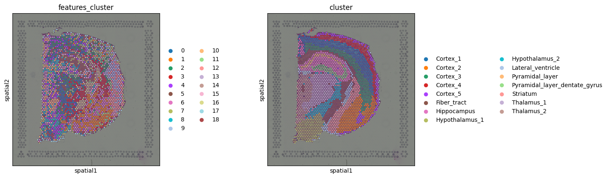
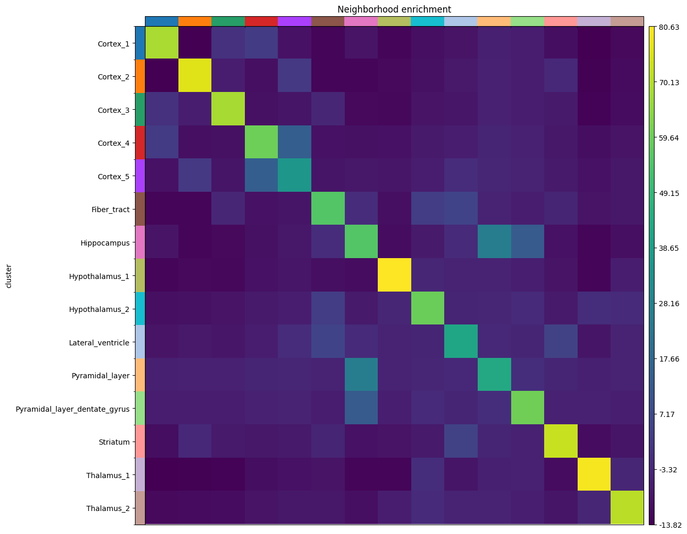
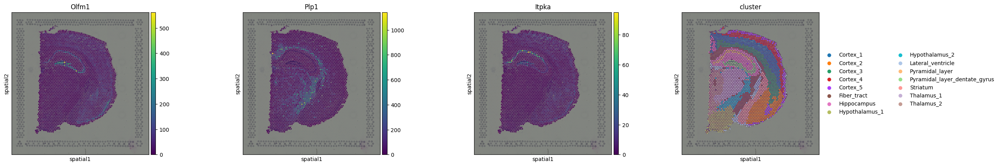

# Notebook 3 — Spatial Graph Analysis with Squidpy (Visium H&E)

**Author:** Saleha Asim  
**Original Tutorial:** [Squidpy Visium H&E Tutorial](https://squidpy.readthedocs.io/en/stable/notebooks/tutorials/tutorial_visium_hne.html)  
**Dataset:** Mouse Brain Coronal Section — 10x Genomics Visium (H&E stained, full section)

---

## Overview

This notebook introduces **spatial statistics** — the core analytical contribution of Squidpy that goes beyond what standard single-cell tools offer. While Notebooks 1 and 2 established how to cluster spots and visualize gene expression in tissue space, this notebook asks more formal biological questions: *which cell types are spatially adjacent to each other more than expected by chance? At what distances do clusters co-occur? Which genes are non-randomly distributed across the tissue?*

The dataset is a full coronal section of the mouse brain with pre-annotated gene expression clusters referenced against the Allen Brain Atlas. This notebook works with an H&E (Haematoxylin and Eosin) stained image rather than the fluorescence image used in Notebook 2. H&E stains nuclei blue and cytoplasm pink, revealing tissue morphology without molecular specificity — the gene expression data provides the molecular layer.

---

## Pipeline

### 1. Data Loading & Spatial Cluster Overview

Data is loaded using Squidpy's built-in loaders, returning a full-section `AnnData` object with annotated clusters and an `ImageContainer` holding the H&E image.

#### Spatial Cluster Annotation


The pre-annotated clusters are plotted on the H&E tissue section. The annotation covers major mouse brain structures including the Hippocampus, Pyramidal layer, Pyramidal layer dentate gyrus, Cortex (multiple sub-regions), Fiber tracts, and Lateral ventricles. This spatial map serves as the reference for all downstream spatial statistics — every subsequent analysis asks how these annotated regions relate to each other in physical space.

---

### 2. Image Feature Extraction & Clustering

Summary image features are extracted at two spatial scales:

- **Scale 1.0** — captures image statistics within the spot boundary at native resolution
- **Scale 2.0** — captures a larger neighbourhood context around each spot, incorporating information from adjacent tissue

Summary features compute per-channel pixel intensity statistics (mean, standard deviation, percentiles) within the defined crop region. Features from both scales are concatenated and fed into the standard PCA → neighbor graph → Leiden clustering pipeline, producing an image-based cluster annotation independent of gene expression.

#### Gene Clusters vs Image Feature Clusters



The left panel shows image-derived clusters; the right shows gene expression clusters. The comparison reveals where the two modalities agree and where they diverge:

**Where they agree:** The Fiber_tract cluster is well-recovered by image features. Fiber tracts are densely myelinated axon bundles that have a distinctive pale, uniform appearance in H&E — high morphological distinctiveness makes them easy to identify from image statistics alone. The hippocampal region is also broadly recapitulated.

**Where they diverge:** The cortex is the most informative divergence. Gene expression reveals the layered structure of the cortex — different transcriptional identities at different cortical depths, reflecting the well-established laminar architecture of six cortical layers. Image features instead separate the cortex by broader spatial region rather than by layer, because H&E staining at Visium resolution does not clearly differentiate adjacent cortical layers morphologically. This illustrates a fundamental difference: gene expression captures cell identity at molecular resolution, while image features capture morphological character — and these are not always the same thing.

---

### 3. Neighborhood Enrichment

Neighborhood enrichment is the first purely spatial statistic in this notebook. It asks: **for each pair of cluster types, do they appear as spatial neighbors more or less often than would be expected if spots were randomly distributed?**

The analysis proceeds in two steps. First, `sq.gr.spatial_neighbors` builds a spatial connectivity graph by connecting each Visium spot to its immediate neighbors based on physical distance on the tissue. Then `sq.gr.nhood_enrichment` runs a permutation test: it shuffles cluster labels 1000 times and counts how often each cluster pair is adjacent in the permuted data, comparing this null distribution to the observed co-adjacency count. A high positive score means the two clusters are spatially closer than chance; a negative score means they are spatially segregated.

#### Neighborhood Enrichment Heatmap



The heatmap shows enrichment scores for all cluster pairs. Warm colors (positive scores) indicate clusters that are frequently neighbors; cool colors (negative scores) indicate clusters that are spatially distant from each other.

The most prominent finding is the strong positive enrichment between **Pyramidal_layer**, **Pyramidal_layer_dentate_gyrus**, and the broader **Hippocampus** cluster. This is anatomically expected: the pyramidal layer is the main cell body layer of the hippocampus, and the dentate gyrus is an anatomical subfield of the hippocampus. Their physical proximity in the tissue is reflected as high neighborhood enrichment scores — the analysis is recovering known neuroanatomy from coordinates alone.

Negative scores between distant anatomical regions (e.g. cortex and hippocampus) confirm that the spatial graph is meaningful: clusters that are anatomically separated in the brain are correctly identified as non-neighbors. This validates both the cluster annotation and the spatial graph construction.

---

### 4. Co-occurrence Analysis

Co-occurrence extends the neighbor analysis across **a range of distances** rather than just immediate adjacency. It computes the following score at increasing radii around each spot:

$$\text{co-occurrence score} = \frac{p(\text{exp} \mid \text{cond})}{p(\text{exp})}$$

Where $p(\text{exp} \mid \text{cond})$ is the probability of observing cluster *exp* within a given radius, conditioned on the presence of cluster *cond* at the center, and $p(\text{exp})$ is the unconditional probability of observing *exp* anywhere. A score above 1 means the two clusters co-occur more than chance at that distance; a score of 1 means random; below 1 means spatial avoidance.

The key distinction from neighborhood enrichment is that **co-occurrence is distance-resolved**: it reveals not just *whether* two clusters are spatially associated, but *at what spatial scale* that association exists.

#### Co-occurrence Score — Hippocampus as Anchor


The plot shows co-occurrence scores for all clusters relative to the **Hippocampus** cluster as the anchor condition, across increasing radii (in pixels of the source image).

**Pyramidal_layer** shows the highest co-occurrence score at short distances, peaking at small radii and decaying toward 1 as distance increases. This means Pyramidal_layer spots are predominantly found immediately surrounding Hippocampus spots — consistent with the known anatomy where the pyramidal cell layer forms the inner boundary of the hippocampal region. The tight spatial association at short range validates the physical organization of these structures.

**Pyramidal_layer_dentate_gyrus** shows a similar but slightly different distance profile, reflecting the more distal position of the dentate gyrus relative to the core hippocampal field.

Clusters such as Cortex and Fiber_tracts converge toward a co-occurrence score of approximately 1 at all distances, indicating spatial independence — they are neither enriched nor depleted near hippocampal spots at any scale.

This distance-resolved view is more informative than neighborhood enrichment alone: two clusters could be statistically enriched as neighbors yet show very different distance decay profiles, revealing whether their proximity is restricted to a tight boundary or extends across a broader spatial zone.

---

### 5. Spatially Variable Genes — Moran's I

The final analysis identifies genes whose expression is **spatially autocorrelated** — i.e. genes that are not randomly scattered across the tissue but instead cluster in specific spatial patterns. This is quantified using **Moran's I**, a classical spatial statistics measure borrowed from geography and ecology.

Moran's I ranges from -1 to +1:
- **+1** — perfectly clustered: nearby spots have very similar expression (strong spatial pattern)
- **0** — spatially random: no relationship between a spot's expression and its neighbors'
- **-1** — perfectly dispersed: every spot has expression opposite to its neighbors

The analysis is run on the top 1000 highly variable genes using `sq.gr.spatial_autocorr(mode="moran")`. Results are ranked by Moran's I statistic and stored in `adata.uns['moranI']`. The top-scoring genes are those with the strongest, most consistent spatial expression patterns across the tissue.

#### Spatial Expression of Top Moran's I Genes



Three top-scoring genes are visualized spatially alongside the cluster annotation:

**Olfm1** (Olfactomedin-1): A secreted glycoprotein involved in neural development and synaptic signaling. Its spatial expression pattern is enriched in the hippocampal and cortical regions, consistent with its known role in neuronal maturation and the dense synaptic architecture of these areas. The strong Moran's I score reflects the tight spatial confinement of its expression to these neuronal regions.

**Plp1** (Proteolipid Protein 1): The most abundant protein in myelin, expressed by oligodendrocytes. Its spatially autocorrelated expression marks the fiber tracts — white matter regions of densely packed myelinated axons. Plp1 is a classical oligodendrocyte/myelin marker, so its confinement to fiber tract regions is a direct molecular validation of that cluster's identity. High Moran's I for Plp1 is expected: myelinated regions are anatomically discrete, so Plp1-high spots cluster tightly together.

**Itpka** (Inositol 1,4,5-trisphosphate 3-kinase A): An enzyme involved in calcium signaling and actin dynamics, highly expressed in neurons — particularly in the pyramidal layers. Its spatial pattern tracks the pyramidal layer clusters, further reinforcing the molecular identity of those anatomical regions.

The spatial patterns of these three genes are not arbitrary: each maps onto a biologically coherent structure. Moran's I has successfully identified genes whose expression is shaped by tissue architecture, and whose spatial distribution corroborates the cluster annotations derived from unbiased gene expression clustering.

---

## Key Takeaways

- **Neighborhood enrichment** identifies which cluster pairs are spatially adjacent more than chance, recovering known anatomical proximities (hippocampal sub-regions neighboring each other) purely from spatial coordinates and cluster labels.
- **Co-occurrence analysis** reveals the distance scale at which spatial associations operate — Pyramidal_layer is tightly co-occurring with Hippocampus at short range, with the association decaying as distance increases.
- **Image feature clusters** and gene clusters broadly agree on major structures (fiber tracts, hippocampus) but diverge on fine-grained structure (cortical layers), demonstrating the complementary resolution of the two modalities.
- **Moran's I** identifies spatially autocorrelated genes that map onto discrete anatomical structures — Plp1 to fiber tracts, Olfm1 and Itpka to neuronal layers — providing molecular validation of the spatial cluster annotations.
- Together, these analyses demonstrate that spatial context is not just a visualization aid: it is a biological dimension that constrains and validates the interpretation of gene expression data.

---

## Dependencies

```bash
pip install anndata scanpy squidpy numpy pandas
```

## References

- Palla et al. (2022) Squidpy: a scalable framework for spatial omics analysis. *Nature Methods*. https://doi.org/10.1038/s41592-021-01358-2
- Moran, P.A.P. (1950) Notes on continuous stochastic phenomena. *Biometrika*. https://doi.org/10.2307/2332142
- Efremova et al. (2020) CellPhoneDB: inferring cell–cell communication from combined expression of multi-subunit ligand–receptor complexes. *Nature Protocols*. https://doi.org/10.1038/s41596-020-0292-x
- Wolf et al. (2018) SCANPY: large-scale single-cell gene expression data analysis. *Genome Biology*. https://doi.org/10.1186/s13059-017-1382-0

